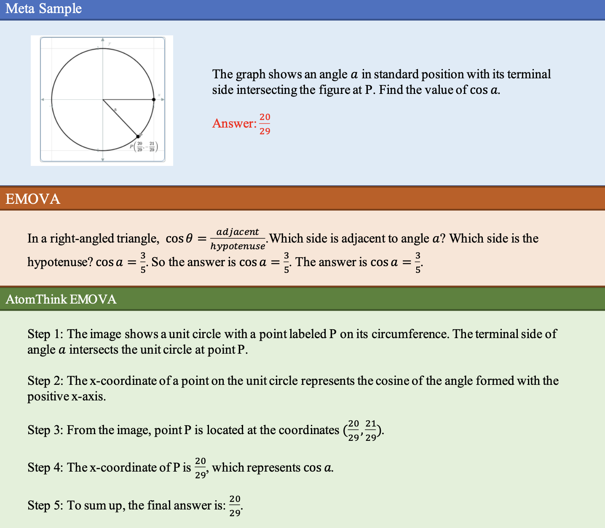
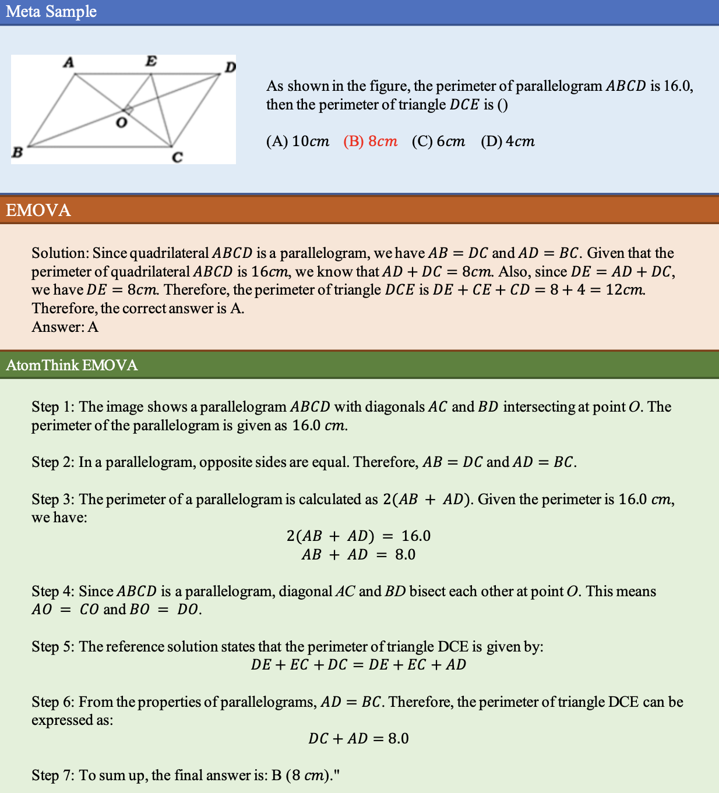
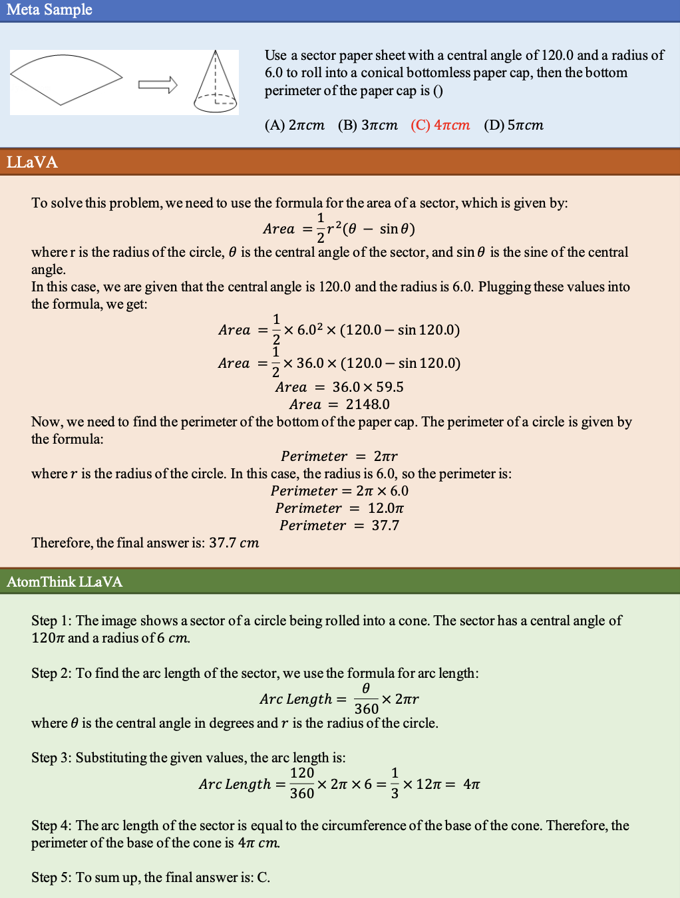
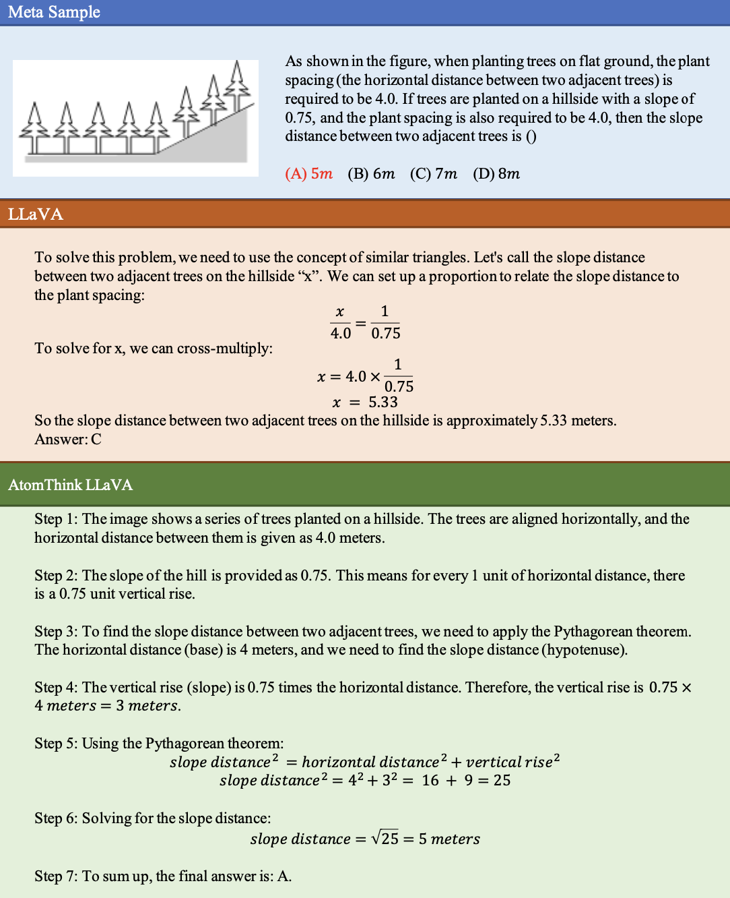
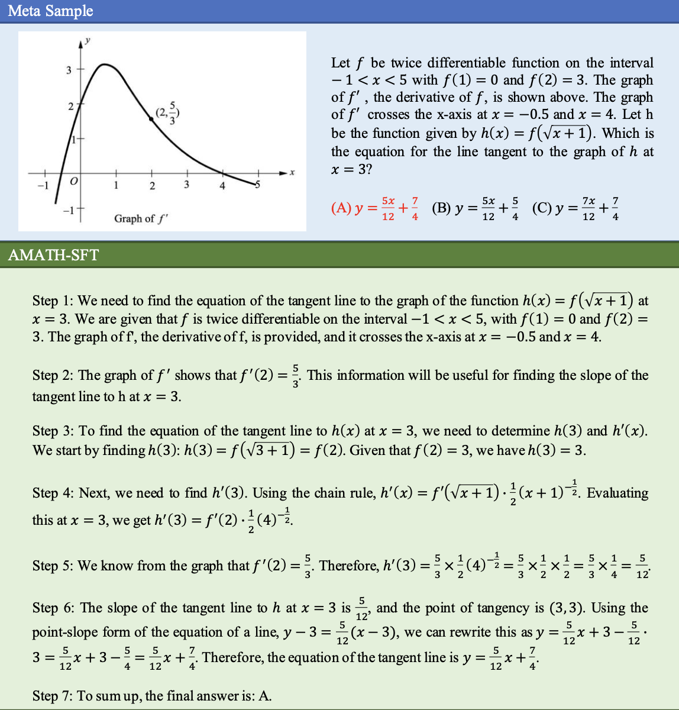
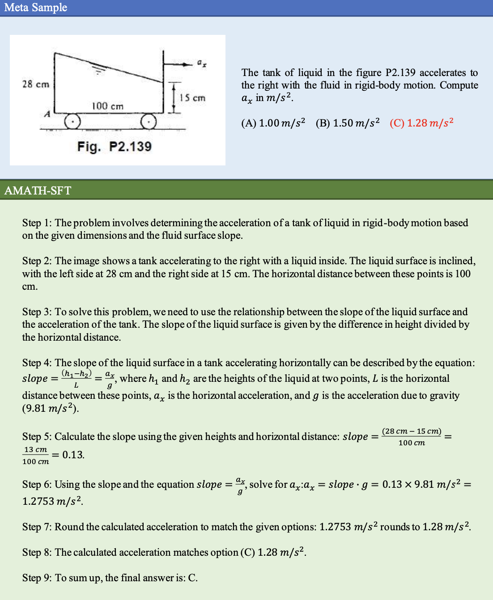
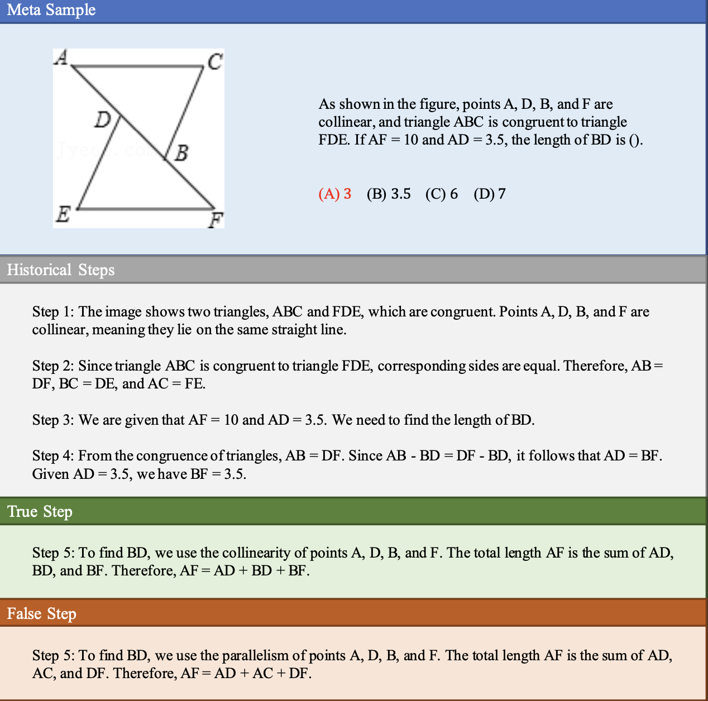
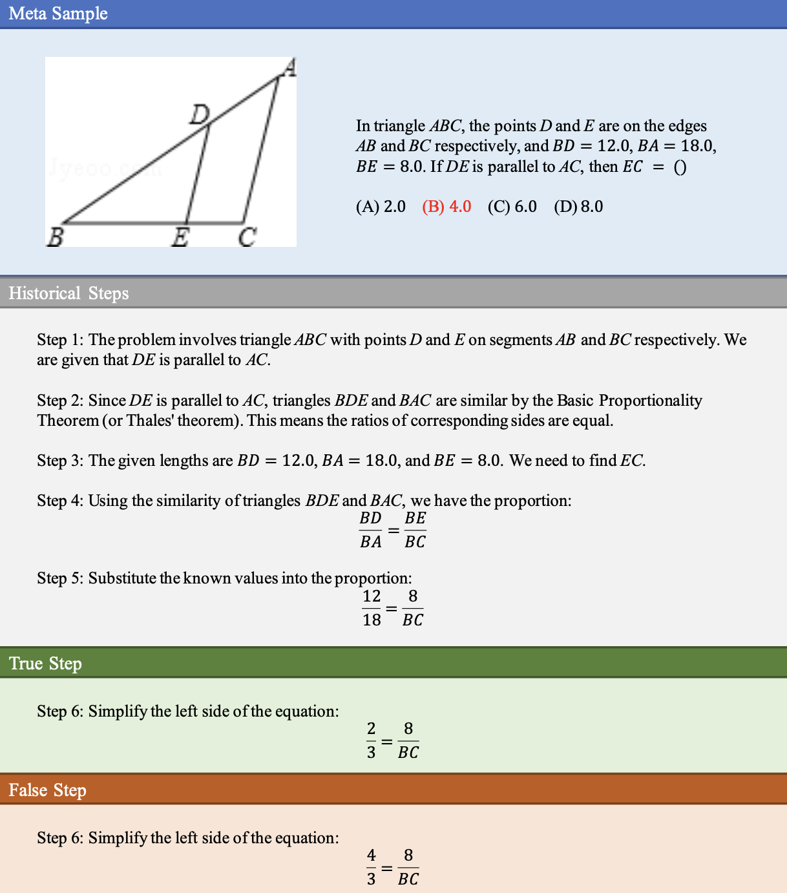

<p align="center">   <a href="https://arxiv.org/abs/2411.11930" style="text-decoration:none;">     <h1><strong>AtomThink: A Slow Thinking Framework for Multimodal Mathematical Task</strong></h1>   </a> </p>

<p align="center">
  
</p>

<p align="center">
  <a href="https://github.com/Quinn777/AtomThink/stargazers">
    
  </a>
  <a href="https://github.com/Quinn777/AtomThink/issues">
    
  </a>
  <a href="https://arxiv.org/abs/2411.11930">
    
  </a>
  <a href="https://github.com/Quinn777/AtomThink/blob/main/LICENSE">
    

<p align="center">
🎉Thank you for exploring AtomThink! We warmly invite you to ⭐️ star this repository, share your feedback via issues, and contribute to the project.
</p>


## 📝 Contents

- [News](#News)
- [Features](#Features)
- [Examples](#Examples)
- [Dataset](#Dataset)
- [Usage](#usage)
- [Citation](#Citation)
- [License](#license)

---


## 📣 News

- **[Upcoming]** Our code, model and datasets will be released soon. Stay tuned for updates!  

- **[2024-11-20]** The paper *AtomThink: A Slow Thinking Framework for Multimodal Mathematical Task* is now available on [arXiv](https://arxiv.org/abs/2411.11930)!

- **[2024-11-20]** Thank you for visiting this repository!

---


## 💡Features

 **Key Features**  

- 🧠 Introduces **GPT-o1** style reasoning via long CoT for complex multimodal mathematical tasks.
- 🛠️ Combines a CoT annotation engine, atomic step fine-tuning, and policy search strategies to enhance reasoning.
- 📊 A capability evaluation metric to perform a quality assessment of each reasoning steps.
- ⚡ Test-time scaling law in MLLM.

- 📈 State-of-the-art performance in multimodal mathematical reasoning tasks.


<p align="center">    </p>

**Abstract**

> In this paper, we address the challenging task of multimodal mathematical reasoning by incorporating the ability of  “slow thinking” into multimodal large language models (MLLMs). Contrary to existing methods that rely on direct or fast thinking, our key idea is to construct long chains of thought (CoT) consisting of atomic actions in a step-by-step manner, guiding MLLMs to perform complex reasoning. To this end, we design a novel AtomThink framework composed of three key modules: (i) a CoT annotation engine that automatically generates high-quality CoT annotations to address the lack of high-quality visual mathematical data; (ii) an atomic step fine-tuning strategy that jointly optimizes an MLLM and a policy reward model (PRM) for step-wise reasoning; and (iii) four different search strategies that can be applied with the PRM to complete reasoning. Additionally, we propose AtomMATH, a large-scale multimodal dataset of long CoTs, and an atomic capability evaluation metric for mathematical tasks. Extensive experimental results show that the proposed AtomThink significantly improves the performance of baseline MLLMs, achieving approximately 50\% relative accuracy gains on MathVista and 120\% on MathVerse.

[Read the full paper](https://arxiv.org/abs/your-paper-id)


---


## 🚀 Examples

We present the atomic CoT outputs generated by LLaVA-Llama3-8B and EMOVA-8B models trained with AtomThink. Compared to the original models, we are able to produce a structured thinking process similar to OpenAI-o1.

Example1:

<p align="center">    </p>


Example2:

<p align="center">    </p>


Example3:

<p align="center">    </p>


Example4:

<p align="center">    </p>


---


## 🖼️ Dataset


The details of our AtomMATH dataset are shown in the table below. AMATH-SFT is used for instruction fine-tuning, while AMATH-PRM is used to train the policy reward model for language process supervision.

| **Source** | **Meta Samples** | **AMATH-SFT** | **AMATH-PRM** |
| ---------- | ---------------- | ------------- | ------------- |
| CLEVR      | 1929             | 11.2k         | 25k           |
| Geometry3K | 1201             | 11.1k         | 15.6k         |
| MAVIS      | 3654             | 17.7k         | 30.5k         |
| TabMWP     | 2463             | 15.7k         | 25.7k         |
| GeomVerse  | 1347             | 9.9k          | 17k           |
| MathV360K  | 10157            | 53.5k         | 24.8k         |
| MMMU       | 76               | 0.6k          | 1.2k          |
| GeoQA+     | 2082             | 19.5k         | 0             |
| IconQA     | 3199             | 18.1k         | 0             |
| **Total**  | **26108**        | **157k**      | **130k**      |


Example1 of AMATH-SFT dataset

<p align="center">    </p>


Example2 of AMATH-SFT dataset

<p align="center">    </p>


Example1 of AMATH-PRM dataset

<p align="center">    </p>


Example2 of AMATH-PRM dataset

<p align="center">    </p>

---


## ⚙️ Usage

Our code, model and datasets will be released soon. Stay tuned for updates!  


---


## 📖 Citation

If you find this project useful, please cite our paper:
```
@article{xiang2024atomthink,
  title={AtomThink: A Slow Thinking Framework for Multimodal Mathematical Reasoning
},
  author={Kun Xiang},
  journal={arXiv preprint arXiv:2411.11930},
  year={2024},
  doi={https://doi.org/10.48550}
}
```


---


## 📄 License

This project is licensed under the [MIT License](LICENSE).  


<p align="center">✨ Thank you for your interest in our work! ✨</p>
