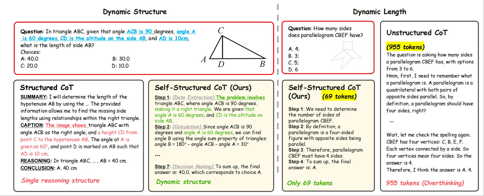
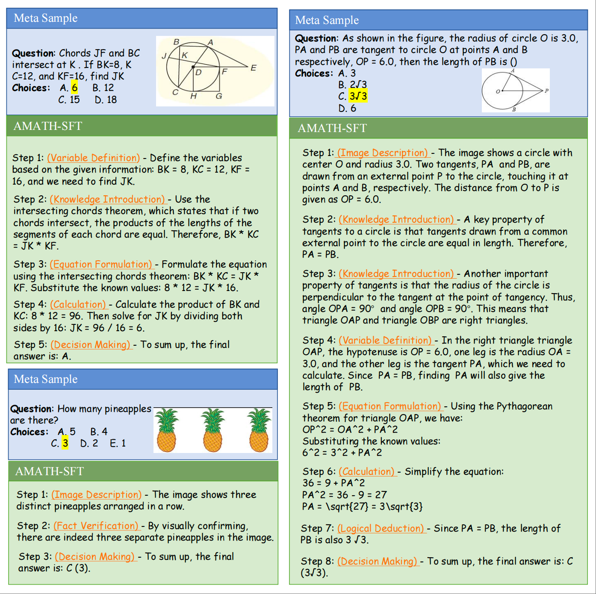

<p align="center">   <a href="https://arxiv.org/abs/2411.11930" style="text-decoration:none;">     <h1><strong>Can Atomic Step Decomposition Enhance the Self-structured Reasoning of Multimodal Large Models?</strong></h1>   </a> </p>

<p align="center">
  
</p>

<p align="center">
  <a href="https://github.com/Quinn777/AtomThink/stargazers">
    
  </a>
  <a href="https://github.com/Quinn777/AtomThink/issues">
    
  </a>
  <a href="https://arxiv.org/abs/2411.11930">
    
  </a>
  <a href="https://github.com/Quinn777/AtomThink/blob/main/LICENSE">
    

<p align="center">
🎉Thank you for exploring AtomThink! We warmly invite you to ⭐️ star this repository, share your feedback via issues, and contribute to the project.
</p>


## 📝 Contents

- [News](#News)
- [Features](#Features)
- [Case Study](#casestudy)
- [Dataset](#Dataset)
- [Usage](#usage)
- [Citation](#Citation)
- [License](#license)
- [Acknowledgement](#acknowledgement)

---


## 📣 News
- **[2025-03-14]** The model *AtomThink-Llama-3.2-Vision-11B* is now available on [AtomThink-Llama-3.2-Vision-11B](https://huggingface.co/Quinn777/AtomThink-Llama-3.2-Vision-11B)!
- **[2025-03-14]** The model *AtomThink-LLaVA1.5-7B* is now available on [AtomThink-LLaVA1.5-7B](https://huggingface.co/Quinn777/AtomThink-LLaVA1.5-7B)!
- **[2025-03-14]** The dataset *AMATH-SFT* is now available on [AMATH-SFT](https://huggingface.co/datasets/Quinn777/AMATH-SFT)!
- **[2025-03-11]** The paper *Can Atomic Step Decomposition Enhance the Self-structured Reasoning of Multimodal Large Models?* is now available on [arXiv](https://arxiv.org/abs/2411.11930)!
- **[2025-03-11]** Thank you for visiting this repository!

---


## 💡Features

 **Key Features**  

- 🧠 Introduces **GPT-o1** style reasoning via long CoT for complex multimodal mathematical tasks.
- 🛠️ Combines a CoT annotation engine, atomic step fine-tuning, and policy search strategies to enhance reasoning.
- 📊 A capability evaluation metric to perform a quality assessment of each reasoning steps.
- ⚡ Test-time scaling law in MLLM.

- 📈 State-of-the-art performance in multimodal mathematical reasoning tasks.


<p align="center">    </p>

**Abstract**

>  In this paper, we address the challenging task of multimodal mathematical reasoning by incorporating the ability of "slow thinking" into multimodal large language models (MLLMs). Our core idea is that different levels of reasoning abilities can be combined dynamically to tackle questions with different complexity. To this end, we propose a paradigm of Self-structured Chain of Thought (SCoT), which is composed of minimal semantic atomic steps. Different from existing methods that rely on structured templates or free-form paradigms, our method can not only generate cognitive CoT structures for various complex tasks but also mitigates the phenomenon of overthinking. To introduce structured reasoning capabilities into visual understanding models, we further design a novel AtomThink framework with four key modules, including (i) a data engine to generate high-quality multimodal reasoning paths; (ii) a supervised fine-tuning process with serialized inference data;  (iii) a policy-guided multi-turn inference method; and (iv) an atomic capability metric to evaluate the single step utilization rate. We conduct extensive experiments to show that the proposed AtomThink significantly improves the performance of baseline MLLMs, achieving more than 10\% average accuracy gains on MathVista and MathVerse. Compared to state-of-the-art structured CoT approaches, our method not only achieves higher accuracy but also improves data utilization by 5 times and boosts inference efficiency by 85.3\%.


<p align="center">    </p>
Comparison with structured and unstructured reasoning models. We are capable of autonomously generating dynamic structures and lengths based on the type of problem. For text-dominant questions as shown on the left, we bypass image caption and directly extracted information from the question stem. For the low-difficulty problem on the right, we use fewer tokens compared to o1-like model.

<p align="center">    </p>
Comparison of the average response length in AtomThink-LlamaV over benchmarks with different complexity. (a) As tasks become more challenging, the model proactively utilizes more tokens. (b) The proportion of longer CoT containing a greater number of atomic steps increases in outputs. A higher level signifies increased difficulty. The performance decline margin of AtomThink modes are more narrow (-20.4\% v.s. -30.7\% in LLaVA1.5, -30\% v.s. -43.0\% in LlamaV).

---


## ⚙️ Usage


#### Quick Start

Install the environment as follows:

```
pip install -r requirements.txt
```

Set up your OpenAI API key:

```
os.environ['OPENAI_API_KEY'] = 'YOUR KEY'
```

Start training:
```
cd Atomthink
config=configs/train_full/llama32-11b-vision/llava100k_amath126k_clean_epoch1_2e6.yaml
torchrun --nproc_per_node 8 --master_addr $master_addr --nnodes $nnode --node_rank $node_rank --master_port $port src/train.py $config
```

Start evaluating:

```
python src/llamafactory/evaluation/run_evaluation_parallel.py \
--node_rank $node_rank \
--total_gpus $total_gpus \
--nproc_per_node 8 \
--temperature 0.0 \
--tasks_per_gpu 1 \
--config "$config" \
--task 'MathVision' \
--prompt 'slow' \
--method 'slow' \
--atomthink_beam_search_num 2 \
--candidate_num 3 \
--max_sampling_count 300
```


---


## 🚀 Case Study

We present the atomic samples in AMATH dataset. 

Example1:

<p align="center">    </p>


Example2:

<p align="center">    </p>


---


## 📖 Citation

If you find this project useful, please cite our paper:
```
@article{xiang2025can,
  title={Can Atomic Step Decomposition Enhance the Self-structured Reasoning of Multimodal Large Models?},
  author={Xiang, Kun and Liu, Zhili and Jiang, Zihao and Nie, Yunshuang and Cai, Kaixin and Yin, Yiyang and Huang, Runhui and Fan, Haoxiang and Li, Hanhui and Huang, Weiran and others},
  journal={arXiv preprint arXiv:2503.06252},
  year={2025}
}
@article{xiang2024atomthink,
  title={AtomThink: A Slow Thinking Framework for Multimodal Mathematical Reasoning},
  author={Xiang, Kun and Liu, Zhili and Jiang, Zihao and Nie, Yunshuang and Huang, Runhui and Fan, Haoxiang and Li, Hanhui and Huang, Weiran and Zeng, Yihan and Han, Jianhua and others},
  journal={arXiv preprint arXiv:2411.11930},
  year={2024}
}
```


---


## 📄 License

This project is licensed under the [MIT License](LICENSE).  


## 🙏 Acknowledgement

We would like to thank the following repositories for their contributions:
- [hiyouga/LLaMA-Factory](https://github.com/hiyouga/LLaMA-Factory): This library was used for training.
- [bklieger-groq/g1](https://github.com/bklieger-groq/g1): This library was used for data processing.
- [openreasoner/openr](https://github.com/openreasoner/openr): This tool was helpful for deploying the process supervision model.

 

---


<p align="center">✨ Thank you for your interest in our work! ✨</p>
